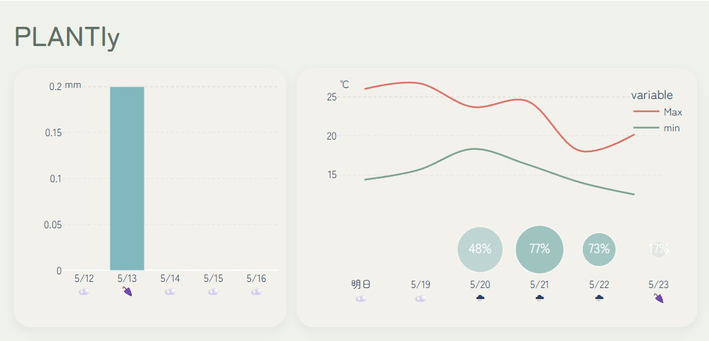

# Plantly 🌱

A weather-powered dashboard that helps you make better plant care decisions.

Plantly analyzes weather forecasts and recent rainfall data to provide simple insights about watering, temperature, rain, and UV conditions.


## 🖼️ Screenshot




## 🌿 Features

- 🌦 Real-time weather data from Open-Meteo
- 📊 Hourly + daily interactive graphs
- 💧 Watering recommendations based on recent rainfall
- 🌡 Temperature summary for the next 12 hours
- ☔ Rain forecast with probability visualization
- ⚡ UV risk indicator
- 🔄 Auto-refresh every hour


## 🚀 Getting Started
### requirements 
Python 3.11+
Internet connection

### Installation
```bash
git clone https://github.com/yourname/Plantly.git
cd Plantly
```
Install dependencies:
```bash
pip install -r requirements.txt
```
### Configuration

Edit config.py and set your location:

```python
LATITUDE = 35.6
LONGITUDE = 139.7
TIMEZONE = "Asia/Tokyo"
```

### Run
```bash
python coreapp.py
```

Then open:
```text
http://localhost:8050
```

## Built With

- [Open-Meteo](https://open-meteo.com/) - Weather forecast API
- [Dash](https://dash.plotly.com/) - Web dashboard framework
- [Plotly](https://plotly.com/python/) - Interactive graphs
- [Pandas](https://pandas.pydata.org/) - Data processing
- [NumPy](https://numpy.org/) — Numerical calculations

## 📈 Data Source

Weather data provided by Open-Meteo:

https://open-meteo.com/

---
## 📄 License

MIT License
